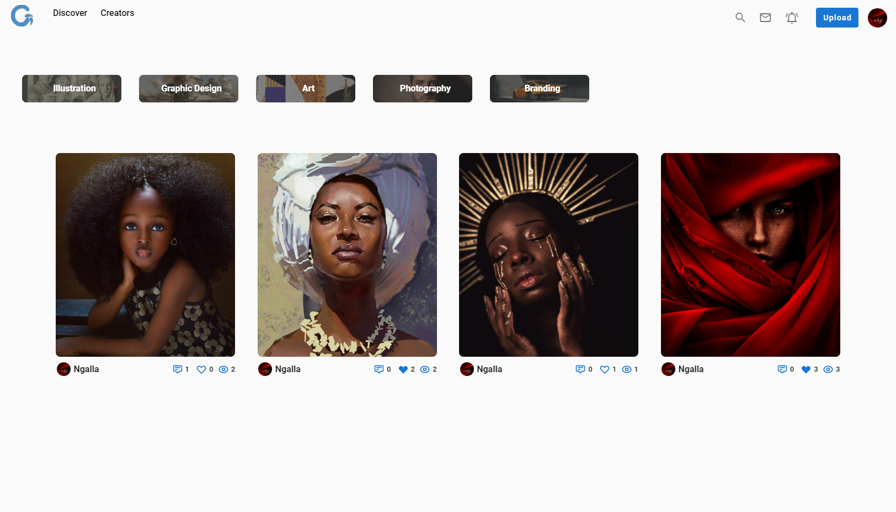
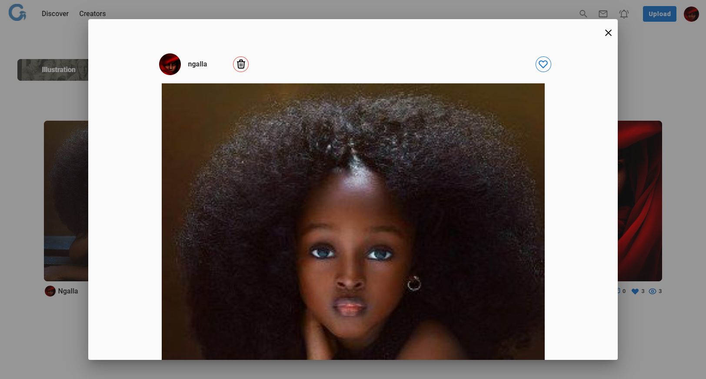
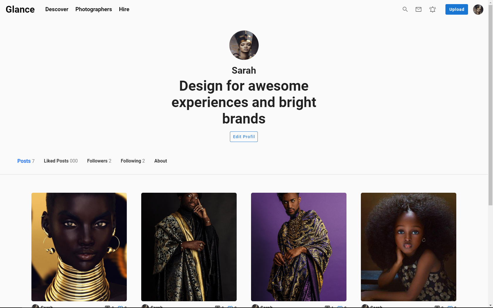
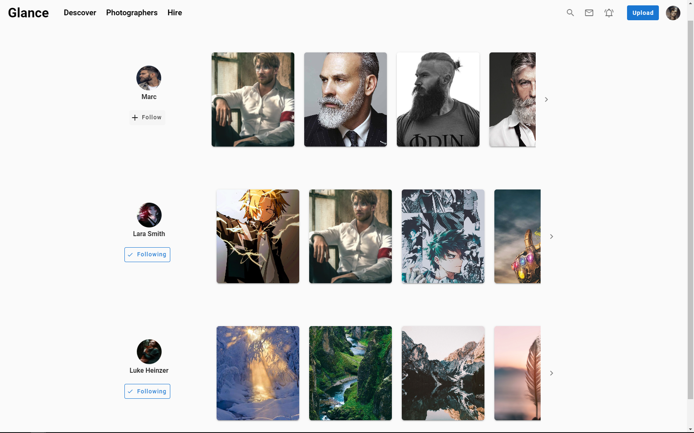

# Description

This is back-end application of the Tailor app.
The tailor App is a platform where tailors can share there works. It's highly inspired by [Dribbble](https://dribbble.com/) and [Twitter](https://twitter.com/).

I made this app for beginners who want to learn [vue](https://vuejs.org/), [vue router](https://router.vuejs.org/) and [vuex](https://vuex.vuejs.org/).



```
----------------------------------
```



```
----------------------------------
```



```
----------------------------------
```


```
----------------------------------
```



```
----------------------------------
```


```
----------------------------------
```

On Windows, use the instrutions below to get started.

## Install Vue

```
https://vuejs.org/v2/guide/installation.html
Clone the project & get intot the project directory
```

## Project setup

```
npm install
```

### Compiles and hot-reloads for development

```
npm run serve
```

### Compiles and minifies for production

```
npm run build
```

## .Env Variables

For environement varaibles see the [.env.example](./.env.example) file
